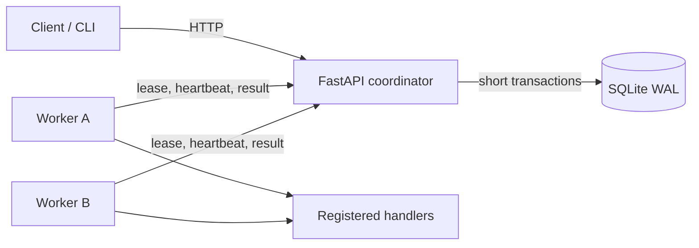
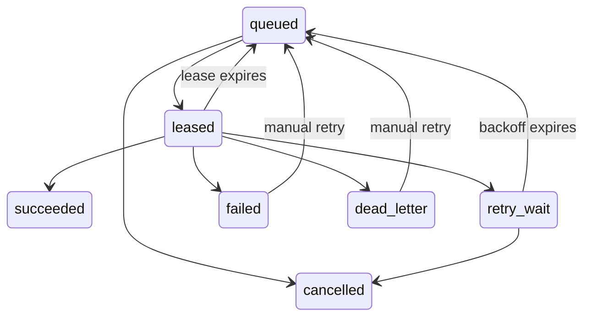

# TaskQueue

TaskQueue is a résumé-ready, local background-job system built with FastAPI, SQLAlchemy, SQLite, HTTPX, and Typer. It focuses on queue correctness: durable storage, atomic worker leases, heartbeat recovery, lease-token fencing, idempotent submission, retries, and dead-letter handling.

It is an educational system—not a replacement for Celery, Sidekiq, Kafka, or a managed task queue.

## Architecture



Workers never access SQLite. They execute only `generate_report`, `deliver_webhook`, and `simulate_failure`; arbitrary commands and client-supplied code are impossible.



## Install and run

Requires Python 3.11+.

```bash
python -m venv .venv
source .venv/bin/activate  # Windows: .venv\Scripts\activate
pip install -e ".[dev]"
taskqueue server
```

In other terminals:

```bash
taskqueue worker --name worker-1
taskqueue worker --name worker-2
taskqueue submit generate_report examples/report.json
taskqueue submit simulate_failure examples/failure.json
taskqueue status JOB_ID
taskqueue list --state queued
taskqueue cancel JOB_ID
taskqueue retry JOB_ID
```

The API provides submission, inspection, filtering, cancellation, manual retry, leasing, heartbeat, completion, failure, health, and JSON queue metrics endpoints. OpenAPI documentation is at `http://127.0.0.1:8000/docs`.

## Reliability semantics

Leasing uses a conditional SQLite update inside a short transaction. Concurrent workers may select the same candidate, but only one can change it from `queued` to `leased`; the others observe a zero-row update and move on. Each successful claim creates a random lease token.

Every heartbeat and result supplies the worker ID and current token. Conditional database updates validate the job state, worker, token, and unexpired lease in the same statement. An expired job is returned to `queued`, and reassignment creates a new token. A late result from the old worker is therefore rejected with HTTP 409. Heartbeats extend a live lease using the worker's configured lease duration. Recovery happens deterministically before each lease operation, so no scheduler is required.

Delivery is **at least once**. If a handler causes a side effect and the worker crashes before recording success, TaskQueue can run it again. Handler side effects should therefore be idempotent. TaskQueue does not claim exactly-once execution.

Submission idempotency keys are unique. A retry with the same normalized job type and payload returns the original job; conflicting content receives HTTP 409. Retryable failures use capped exponential backoff and become dead letters after exhausting attempts. Permanent failures are not retried. Failed and dead-lettered jobs can be manually requeued.

`deliver_webhook` signs a canonical payload with HMAC-SHA256 and a stable delivery ID. It rejects unsafe schemes, credentials, and private destinations (loopback is explicitly allowed for local development). Timeouts, network errors, 429, and 5xx retry; most 4xx responses are permanent. Public error messages are sanitized, and response streaming stops after the bounded preview is collected.

## Verification and demonstrations

```bash
ruff check .
pytest -q
python scripts/demo_failure_recovery.py
python scripts/benchmark.py
```

The demo shows Worker A losing its lease, Worker B reclaiming and completing it, stale Worker A being fenced out, and an idempotent resubmission returning the original ID.

The test suite covers submission validation, concurrent idempotency, atomic leasing and completion, heartbeats, lease expiry, stale-token fencing, retry backoff, dead-letter recovery, terminal states, API restart durability, registered handlers, webhook classifications and HMAC signatures, competing HTTP workers, heartbeat loss, graceful shutdown, filters, and metrics.

The benchmark submits and completes 500 lightweight jobs for 1, 2, and 4 service-layer worker threads. It records only executed local measurements in `reports/benchmark.json` and `reports/benchmark.md`; these are local SQLite coordination figures, not HTTP-worker or production-scale claims.

Latest measured run on the local development machine:

| Workers | Completed | Jobs/s | p50 latency | p95 latency | Active-lease violations |
|---:|---:|---:|---:|---:|---:|
| 1 | 500 | 48.18 | 5.2805 s | 7.9489 s | 0 |
| 2 | 500 | 44.37 | 5.8368 s | 8.7417 s | 0 |
| 4 | 500 | 44.33 | 5.7448 s | 8.8173 s | 0 |

The lower throughput with additional threads is an expected possible result for SQLite's serialized write path; TaskQueue records the observation rather than implying that more local writers must be faster.

## Limitations and production path

- SQLite limits write concurrency, and the API server is a single coordination point.
- Execution is at least once; handler side effects may require independent idempotency protection.
- The local MVP has no authentication and must not run untrusted code.
- Metrics are durable database-derived snapshots, but not a complete event ledger or external monitoring system.
- Production would likely use PostgreSQL or a distributed broker, authentication, stronger SSRF controls, durable metrics and tracing, multiple API instances, migrations, and secret management.
